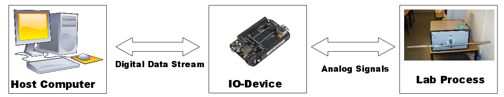
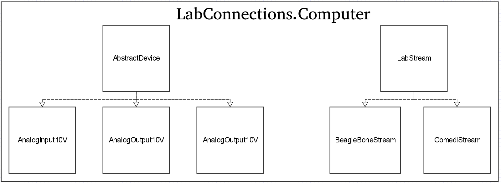

# Welcome to LabConnections.jl - the IO-software part of the LabDev project

The goal of this project is to develop a software package in [Julia](https://julialang.org/)
for interfacing with lab processes using either the [BeagleBone Black Rev C](http://beagleboard.org/) (BBB)
with custom [IO-board cape](https://gitlab.control.lth.se/labdev/ioboards), or the old IO-boxes in the labs using Comedi.
With this package, the user is able to setup a connection between the
host computer and the IO-device, and send and
receive control signals and measurements from the lab process.

The full documentation of the package is available [here](https://gitlab.control.lth.se/labdev/LabConnections.jl/blob/julia1/docs/build/index.md).

## Package Overview
The `LabConnections.jl` package is subdivided into two main modules; `Computer`
and `BeagleBone`. `Computer` defines the user interface on the host
computer side, while `BeagleBone` defines low-level types and functions meant
to be used locally on the BBB.

### Computer

This module contains the user interface on the host computer side, and defines
types for devices/connections to the lab process, and filestreams between the
host computer and different IO-devices (BBB or Comedi). There are currently 3
different device/connection types (each has the abstract super type `AbstractDevice`):
* `AnalogInput10V` : Represents ±10V connections from the lab process to the IO-device. Each instance will correspond to a physical ±10V measurement signal from the lab process, whose value can be read.
* `AnalogOutput10V` : Represents ±10V connections from the IO-device to the lab process. Each instance will correspond to a physical ±10V input signal to the lab process, whose value can be set.  
* `SysLED` : Represents the System LEDs on the BBB. Used for simple testing and debugging from the host computer side.

There are 2 different filestream types (each has the abstract super type `LabStream`):
* `BeagleBoneStream` : Represents the data stream between the host computer and the BBB.
* `ComediStream` : Represent the data stream between the host computer and the old IO-boxes using Comedi.

### BeagleBone

This module defines types representing different pins and LEDs on the BBB, and
functions to change their status and behaviour. There are currently 4 different types defined
(each has the abstract super type `IO_Object`):
* `GPIO` : Represents the BBB's General Purpose Input Output (GPIO) pins.
Each instance will correspond to a physical GPIO pin on the board, and can be
set as an input or output pin, and to output high (1) or low (0).
* `PWM` : Represents the BBB's Pulse Width Modulation (PWM) pins.
Each instance will correspond to a physical PWM pin on the board, which can be
turned on/off, and whose period, duty cycle and polarity can be specified.
* `SysLED` : Represents the 4 system LEDs on the BBB, and can be turned on/off.
Used to perform simple tests and debugging on the BBB.
* `Debug` : Used for debugging and pre-compilation on the BBB. It does
not represent any physical pin or LED on the board.

**Note:** In addition to GPIO and PWM, the BBB also has pins dedicated for [Serial Peripheral
Interface](https://en.wikipedia.org/wiki/Serial_Peripheral_Interface_Bus) (SPI).
Work to feature this functionality in the module `BeagleBone` is currently ongoing. More
information can be found [here](https://gitlab.control.lth.se/labdev/LabConnections.jl/blob/master/docs/build/man/introduction.md#spi-development)

## Getting Started
### Installation
Instructions on installing the required software and setting up a connection between
the host computer and the BBB are found [here](https://gitlab.control.lth.se/labdev/LabConnections.jl/blob/julia1/docs/build/man/installation.md#installation-instructions).

### A Simple Example
We will here go through a simple example of using the host computer interface to communicate with the BBB and control the onboard system LEDs.

First make sure that you have followed the installation guide, and that the BBB is running a server and is connected to the host computer.
Then, start the Julia REPL and input

    using LabConnections.Computer
to load the host computer interface. Then define a file stream `stream` and connect to the server running on the BBB by inputting

    stream = BeagleBoneStream(ip"192.168.7.2")
Now, we continue by defining the LED we want to control

    led = SysLED(1)

The object `led` will now correspond to the first system LED on the BBB.
To tell the BBB that we want to control the LED, we make a call to `init_devices!`

    init_devices!(stream, led)
Now we can start controlling the LED on the BBB. Let's begin by turning it on

    send(led, true)
You should now see the first system LED on the BBB being lit.
The function `send` puts a new command (`true`) to a device (`led`) to the file stream buffer and
sends it immediately to the BBB.
We can read the current status of the LED by calling `read`

    v = read(led)
You should now see a printout saying that the LED is turned on.

We can also stack several commands to the buffer before sending them to the BBB.
We do this with the command `put!`. To turn on 2 LEDS at the same time, we can call

    led2 = SysLED(2)
    led3 = SysLED(3)
    init_devices!(stream, led2, led3)
    put!(led2, true)
    put!(led3, true)
    send(stream)
Similarly we can read from several devices at the same time by using `get`

    get(led2)
    get(led3)
    v1, v2 = read(stream)

### More Examples
There are several examples found [here](https://gitlab.control.lth.se/labdev/LabConnections.jl/blob/master/docs/build/examples/examples.md#examples)
which let's you test out the functionality of `LabConnections.jl`.

Examples of real-world usage are available in [ball-and-beam](https://gitlab.control.lth.se/processes/LabProcesses.jl/blob/master/src/interface_implementations/ballandbeam.jl)
