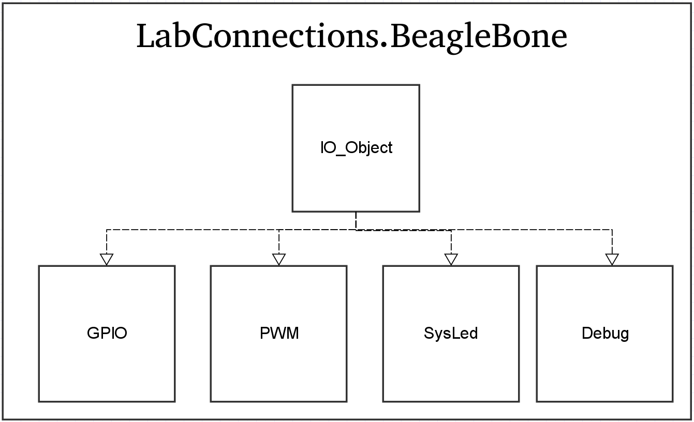

[](https://gitlab.control.lth.se/labdev/LabConnections.jl/commits/master)
[](https://gitlab.control.lth.se/labdev/LabConnections.jl/commits/master)

# Welcome to LabConnections.jl - the IO-software part of the LabDev project
<p align="center">

</p>
The goal of this project is to develop a software package in [Julia](https://julialang.org/)
for interfacing with lab processes using either the [BeagleBone Black Rev C](http://beagleboard.org/) (BB)
with custom [IO-board cape](https://gitlab.control.lth.se/labdev/ioboards), or the old IO-boxes in the labs using Comedi.
With this package, the user is able to setup a connection between the
host computer and the IO-device (BB or old IO-box), and send and
receive control signals and measurements from the lab process.

The full documentation of the package is available [here](https://gitlab.control.lth.se/labdev/LabConnections.jl/blob/julia1/docs/build/index.md).

## Package Overview
The `LabConnections.jl` package is subdivided into two main modules; `LabConnections.Computer`
and `LabConnections.BeagleBone`. `LabConnections.Computer` defines the user interface on the host
computer side, while `LabConnections.BeagleBone` defines low-level types and functions meant
to be used locally on the BB.

### LabConnections.Computer
<p align="center">

</p>

The module `LabConnections.Computer` contains the user interface on the host computer side, and defines
types for devices/connections to the lab process, and filestreams between the
host computer and different IO-devices (BB or Comedi). There are currently 3
different device/connection types (each has the abstract super type `AbstractDevice`):
* `AnalogInput10V` : Represents ±10V connections from the lab process to the IO-device. Each instance will correspond to a physical ±10V measurement signal from the lab process, whose value can be read.
* `AnalogOutput10V` : Represents ±10V connections from the IO-device to the lab process. Each instance will correspond to a physical ±10V input signal to the lab process, whose value can be set.  
* `SysLED` : Represents the System LEDs on the BB. Used for simple testing and debugging from the host computer side.

There are 2 different filestream types (each has the abstract super type `LabStream`):
* `BeagleBoneStream` : Represents the data stream between the host computer and the BB.
* `ComediStream` : Represent the data stream between the host computer and the old IO-boxes using Comedi.

### LabConnections.BeagleBone
<p align="center">

</p>

The module `LabConnections.BeagleBone` defines types representing different pins and LEDs on the BB, and
functions to change their status and behaviour. There are currently 4 different types defined
(each has the abstract super type `IO_Object`):
* `GPIO` : Represents the BB's General Purpose Input Output (GPIO) pins.
Each instance will correspond to a physical GPIO pin on the board, and can be
set as an input or output pin, and to output high (1) or low (0).
* `PWM` : Represents the BB's Pulse Width Modulation (PWM) pins.
Each instance will correspond to a physical PWM pin on the board, which can be
turned on/off, and whose period, duty cycle and polarity can be specified.
* `SysLED` : Represents the 4 system LEDs on the BB, and can be turned on/off.
Used to perform simple tests and debugging on the BB.
* `Debug` : Used for debugging and pre-compilation on the BB. It does
not represent any physical pin or LED on the board.

**Note:** In addition to GPIO and PWM, the BB also has pins dedicated for [Serial Peripheral
Interface](https://en.wikipedia.org/wiki/Serial_Peripheral_Interface_Bus) (SPI).
Work to include this functionality in the module `LabConnections.BeagleBone` is currently ongoing.

## Getting Started
### Installation
First, you should follow the instructions on how to install the required software and setting up a connection between the host computer and the BB. These instructions are found [here](https://gitlab.control.lth.se/labdev/LabConnections.jl/blob/julia1/docs/build/man/installation.md#installation-instructions).

### A Simple Example
This is a simple example that demonstrates the usage of local devices on the BB via a host computer. The devices that will be used in the example are `SysLED` and `GPIO`.

First make sure that you have followed the installation guide, and that the BB is running a server connected to the host computer.
Then, start a Julia REPL on the host computer and type
```
using LabConnections.Computer
using Sockets
```
to load the host computer interface. Then define a file stream and connect to the server running on the BB by typing
```
stream = BeagleBoneStream(ip"192.168.7.2")
```
Now, we continue by defining the onboard LED on the BB we want to control
```
led = SysLED(1)
```
The argument `1` means that the object `led` will correspond to the first system LED on the BB. So far, this definition is only known to the host computer. To tell the BB that we want to control the LED, we make a call to `init_devices!`
```
init_devices!(stream, led)
```
Now the LED object is defined also on the BB, and we can start controlling it from the host computer. Let's begin by turning it on
```
send(led, true)
```
You should now see the first onboard LED on the BB being lit. The function `send` puts a new command (in this case `true`) to a device (in this case `led`) to the file stream buffer and
immediately sends it to the BB.
We can read the current status of the LED by calling `read`
```
v = read(led)
```
You should now see a printout saying that the LED is turned on.

We can also stack several commands to the message buffer before sending them to the BB.
We do this with the command `put!`. To turn on 2 LEDS at the same time, we do the following call
```
led2 = SysLED(2)
led3 = SysLED(3)
init_devices!(stream, led2, led3)
put!(led2, true)
put!(led3, true)
send(stream)
```
Similarly we can read from several devices at the same time by using `get`
```
get(led2)
get(led3)
v1, v2 = read(stream)
```
We can also manipulate other types of devices on the BB. Let's try manipulating a couple of physical GPIO's on the BB. Similar to the LEDs, we begin by defining two `GPIO`-objects and initializing them on the BB
```
gpio112 = GPIO(1, true)
gpio66 = GPIO(29,false)
init_devices!(stream, gpio112, gpio66)
```
When creating the `GPIO`-objects, we input two arguments. The first one is an integer value (1-33) which defines which physical GPIO pin we want to access. The integer corresponds to the index of the physical GPIO in the `gpio_channels`-array defined [here](https://gitlab.control.lth.se/labdev/LabConnections.jl/blob/julia1/src/BeagleBone/IO_Object.jl). Additionally, the pin map of the BB can be found [here](https://gitlab.control.lth.se/labdev/LabConnections.jl/blob/julia1/docs/build/man/development.md#Package-Development-1). The second argument defines if the GPIO should be of output (`true`) or input (`false`) type.

Now that we have access to two GPIO pins, we can e.g set the output pin's value to high (`true`)
```
send(gpio112, true)
```
The physical GPIO pin on the BB will now output a voltage. The other GPIO pin was defined to be of input type, and if we want to read from it we simply type
```
val = read(gpio66)
```
where `val` will be either 0 or 1 depending on the voltage value read by the pin.

### More Examples
More examples for testing out the functionality of `LabConnections.jl` are found [here](https://gitlab.control.lth.se/labdev/LabConnections.jl/blob/master/docs/build/examples/examples.md#examples).

A real-world example using `LabConnections.jl` with the old IO-boxes for controlling the ball and beam process is avaible [here](https://gitlab.control.lth.se/processes/LabProcesses.jl/blob/master/src/interface_implementations/ballandbeam.jl).
