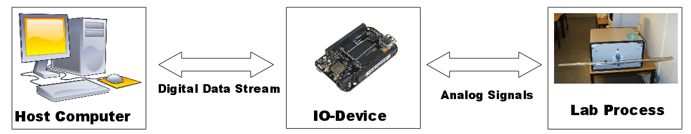

# Introduction

This project is developing a software package in [Julia](https://julialang.org/) for interfacing with lab processes using either the [BeagleBone Black Rev C](http://beagleboard.org/) (BB) with custom [IO-board cape](https://gitlab.control.lth.se/labdev/ioboards), or the old IO-boxes in the labs using Comedi. With this package, the user is able to setup a connection between the host computer and the IO-device, and send and receive control signals and measurements from the lab process.

To get started, first follow the installation instruction found [here](installation.md).

