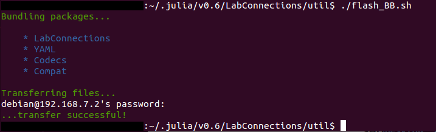

# Installation Instructions

## On the HOST
To get started, first install julia v0.6.X on the PC running a Linux distribution by following the instructions specified [here](https://github.com/JuliaLang/julia/blob/master/README.md). So far, the system has only been testen on Ubuntu 14.* and 16.*.

Once julia is installed julia, run

    `Pkg.clone(https://gitlab.control.lth.se/labdev/LabConnections.jl)'
    `Pkg.add("YAML")'

in the julia prompt to install all dependencies on the HOST.

## On the BeagleBone
On the BeagleBone, first install Debian for 32 bit ARM processors using a micro-SD by following [this guide](http://derekmolloy.ie/write-a-new-image-to-the-beaglebone-black/). You may also include a julia v0.6 tarball, alternatively transferring it using after an installation.

If chosing the latter, connect the BB and download the julia tarball for ARM (ARMv7 32-bit hard float) from [here](https://julialang.org/downloads/) and scp it to /home/debian/ on the BB. Run

    `cd ~/Downloads'
    `scp -r julia-0.6.0-linux-arm.tar.gz debian@192.168.7.2:/home/debian'

next, log on to the BB via SSH by running

    `ssh debian@192.168.7.2'

an unpack the tarball. Julia should now be operational by running

    `/home/debian/julia-<distro specific tag>/bin/julia'

Next, open a new terminal on the HOST and cd to the /util directory of the LabConnection package by running in the julia package folder

    `cd && cd .julia/v0.6/LabConnection/util'

This directory contains some nice utility files to operate the BB from the host. To flash it with the current revision of the software, including all dependencies, simply execut the shells cript `flash.sh'.



## Setting up automatic communication between the BB and the HOST via TCP
To setup automatic start of Julia server on the BB, make sure to have completed all prior installation instructions. SSH to the BeagleBone and copy the julilaserver.service to the systemd/system

    `ssh debian@192.168.7.2'
    `sudo cp -r /home/debian/juliapackets/LabConnections/src/BeagleBone/startup/juliaserver.service /lib/systemd/system/juliaserver.service` (on the BeagleBone)

Then execute the commands

`sudo systemctl enable juliaserver` (on the BeagleBone)
`sudo systemctl start juliaserver` (on the BeagleBone)

After a while, the BeagleBone should start blinking on SysLED 2: on-off-on-sleep-repeat. The server should now start automatically on restart of the BeagleBone, and you should be able to run the examples in in /Examples on the host computer.

```@systemConfiguration
```
