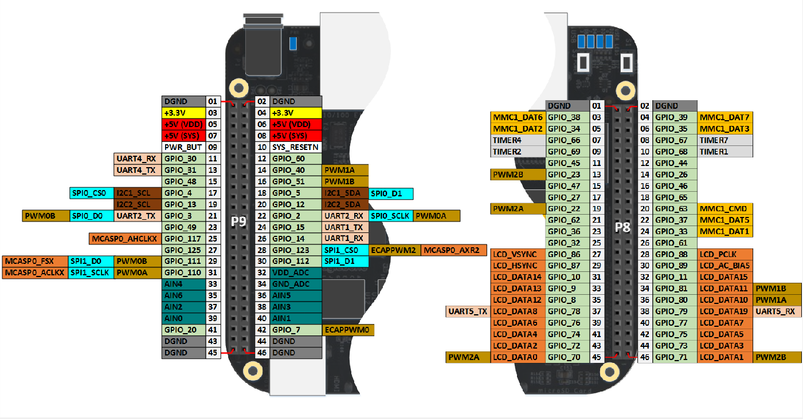

# Package Development

## Host computer development environment
If you want to develop the code in LabConnections.jl, then this is how you setup a development environment. First, open up a Julia REPL and type
```
] dev https://gitlab.control.lth.se/labdev/LabConnections.jl
```
Open a new terminal and navigate to `.julia/dev/LabConnections`, where the package source code is now located. Then type
```
git checkout julia1
git pull
```
to ensure that you are working on the correct development branch for Julia v1.0.X. You can now edit the code in `.julia/dev/LabConnections`
and run it using a Julia REPL. When you are satisfied with your changes, simply commit and push the changes in the `.julia/dev/LabConnections` directory to the GitLab server.

## Development with the BeagleBone

### Transferring development code from host to the BeagleBone
Because of the limited performance of the BeagleBone (BB), it is often preferable to do most code development on the host computer. However, you will also do testing of the code locally on the BB, and will thus need to transfer the latest code from the host computer to the BB. To do this, there is a handy utility shell script found in `/util` that handles this. Open a terminal on the host computer and type
```
cd ~/.julia/dev/LabConnections/util
./copyfoldertobb.sh
```
This will transfer the current development version of `LabConnections.jl` found in the `/dev` directory to the BB.

### Development with hardware in the loop
When testing `LabConnections.jl` with hardware in the loop, the external hardware will be connected to the pin headers on the BB. For reference, the pin map of the BeagleBone (BB) is shown below.

<p align="center">

</p>

When running examples and tests with hardware in the loop, take caution not to short the BB ground with any output pin, as this will damage the board. For instance, if connecting a diode to the output pins, always use a resistor of >1 kOhm in parallel.
